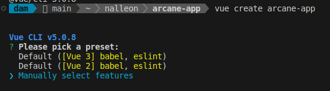
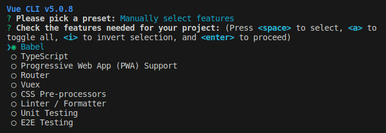
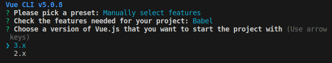
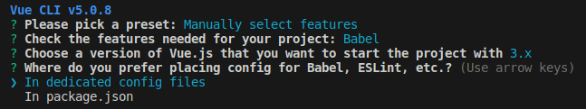
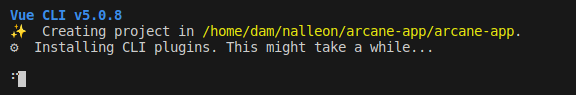
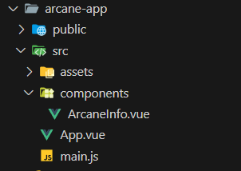
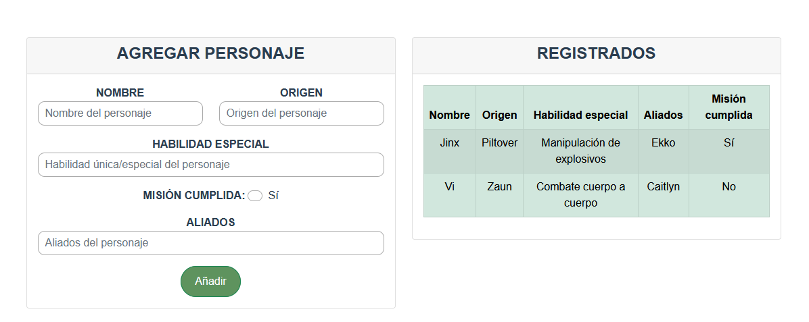
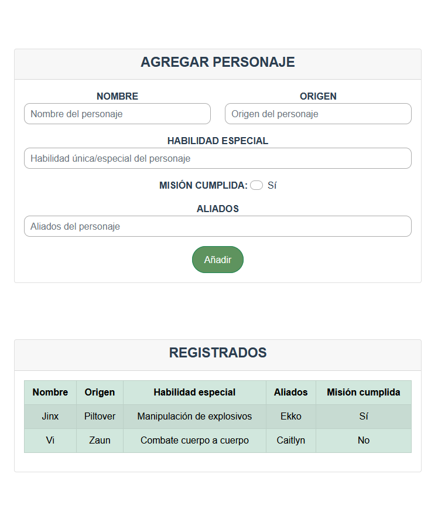
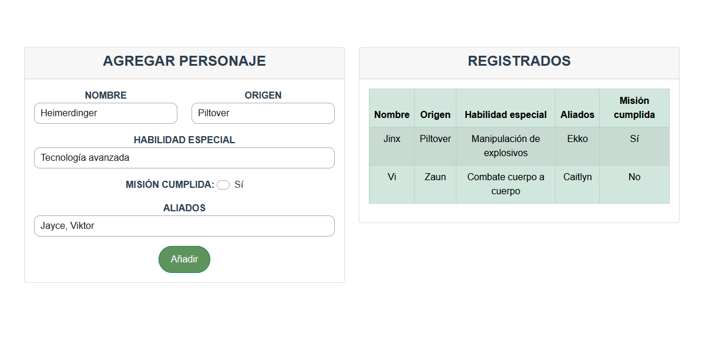
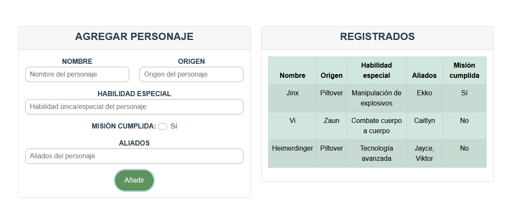

<div align="justify">

# arcane-app
>✒️ __Autor__:  Nabil L.A. ([@nalleon](https://github.com/nalleon))
<div align="center">

</div>


## Índice

- [Descripcion de la actividad](#)
- [Creación del proyecto](#cración-del-proyecto)
- [Estructura de carpetas](#estructura-de-carpetas)
- [Detalles del componete](#detalles-del-componente)
    - [Funcionalidades](#funcionalidades)
    - [Muestra del funcionamiento](#muestra-del-funcionamiento)

***

</br>

## Descripción de la actividad

Pequeña práctica utilizando Vue para el módulo de Desarollo de Interfaces (DAD). La práctica consitse en la creación de un formulario que recoga los datos de personajes y los muestre en una tabla.

Se precisan de los siguientes puntos para realizar bien la actividad:


- Realiza toda la gestión de datos de manera volátil, es decir, sin conexión con APIs ni bases de datos. Los datos se gestionarán directamente en el estado del componente.
- Usa un único componente para combinar las funcionalidades del formulario y la tabla.

- Haz uso de las directivas necesarias que hemos visto en clase para gestionar la interacción y el comportamiento de los elementos del componente.

- Consulta la documentación disponible en el campus como referencia para la implementación.

- Utiliza Bootstrap para proporcionar un diseño visual más atractivo y estructurado a la aplicación.

- La aplicación deberá ser desarrollada utilizando una de las dos formas vistas en clase: Composition API o Option API.

Simplificaciones para esta versión del ejercicio:

- No se requiere separar las funcionalidades en componentes adicionales, todo debe implementarse dentro de un único componente.

- El sistema no requiere persistencia de datos ni funcionalidades avanzadas, solo debe manejar los datos de manera local dentro del componente.

## Creación del proyecto

En primer lugar deberemos de instalar Vue CLI

```bash
npm install -g @vue/cli
```

Seguidamente debemos de asegurarnos de que la instalacion ha sido exitosa, por lo tanto comprobaremos la version:

```bash
vue --version
```

<div align="center">

</div>

Tras esto, procederemos a crear nuestra aplicación vue la cual llamaremos 'arcane-app'. Para ello ejecutaremos el siguiente comando y seleccionaremos las opciones de las fotos:

```bash
vue create arcane-app
```

<div align="center">




</div>


## Estructura de carpetas

En la práctica trabajaremos con la siguiente estructura de carpetas y con un único componente llamada 'AracaneInfo'.

<div align="center">

</div>

## Detalles del componente

En nuestro componente del tipo Composition API, ArcaneInfo, encontramos un formulario destinado a recoger los datos de los personajes y una tabla que refleja los datos ingresados. En este primero se nos permite ingresar la siguiente información de cada personaje:

- Nombre: El nombre del personaje.
- Origen: El origen o lugar de procedencia del personaje.
- Habilidad especial: Una habilidad o poder único del personaje.
- Aliados: Una lista de aliados del personaje, separados por comas.
- Misión cumplida: Un checkbox que permite indicar si el personaje ha cumplido una misión.

El componente se encarga de gestionar estos datos, validarlos y mostrar los personajes registrados en una tabla. Se utiliza Vue.js para la lógica del componente, con una estructura reactiva para los datos, y el framework de Bootstrap para los estilos (principalmente la responsividad) junto con ciertos estilos personalizados para mejorar la apariencia y funcionalidad en el formulario.

- Template:

```javascript
<div class="container mt-4">
    <div class="row">
        <div class="col-12 col-xl-6 mt-5 mb-5">
            <div class="card">
                <div class="card-header">
                    <h4 class="fw-bold text-uppercase">Agregar Personaje</h4>
                </div>
                <div class="card-body">
                    <form @submit.prevent="addCharacter">
                        <div class="row">
                            <div class="col-6 form-group">
                                <label for="name" class="fw-bold text-uppercase">Nombre</label>
                                <input type="text" class="form-control custom-input" id="name" v-model="name" placeholder="Nombre del personaje" required />
                            </div>
                            <div class="col-6 form-group">
                                <label for="origin" class="fw-bold text-uppercase">Origen</label>
                                <input type="text" class="form-control custom-input" id="origin" v-model="origins" placeholder="Origen del personaje"  required />
                            </div>
                        </div>
    
                        <div class="col-12 form-group mt-3">
                            <label for="specialAbility" class="fw-bold text-uppercase">Habilidad especial</label>
                            <input type="text" class="form-control custom-input" id="specialAbility" v-model="specialAbility" placeholder="Habilidad única/especial del personaje"  required />
                        </div>
                        <div class="row">
                            <div class="col-12 mt-3 mb-3">
                                <label class="form-check-label fw-bold text-uppercase" for="missionFulfilled" >Misión cumplida: </label>
                                <input class="form-check-input ms-1 custom-input custom-checkbox" type="checkbox" value="true" id="missionFulfilled">
                                <label class="form-check-label ms-2" for="missionFulfilled">
                                    Sí
                                </label>
                            </div>
                        </div>
                        <div class="col-12 form-group mb-3">
                            <label for="allies" class="fw-bold text-uppercase">Aliados</label>
                            <input type="text" class="form-control custom-input" id="allies" v-model="allies" placeholder="Aliados del personaje"  required />
                        </div>
                        
                        <div class="col-12">
                            <button type="submit" class="btn btn-success custom-btn">Añadir</button>
                        </div>
                    </form>
                </div>
            </div>
        </div>

        <div class="col-12 col-xl-6 mt-5 mb-5">
            <div class="card">
                <div class="card-header">
                    <h4 class="fw-bold text-uppercase"> Registrados</h4>
                </div>
                <div class="card-body">
                    <table class="table table-striped table-bordered table-hover table-success">
                        <thead>
                            <tr>
                                <th>Nombre</th>
                                <th>Origen</th>
                                <th>Habilidad especial</th>
                                <th>Aliados</th>
                                <th>Misión cumplida</th>
                            </tr>
                        </thead>
                        <tbody>
                            <tr v-for="ch in characters" :key="ch.name">
                                <td>{{ ch.name }}</td>
                                <td>{{ ch.origins }}</td>
                                <td>{{ ch.specialAbility }}</td>
                                <td>{{ ch.allies.join(', ') }}</td>
                                <td>{{ ch.missionFulfilled ? 'Sí' : 'No' }}</td>
                            </tr>
                        </tbody>
                    </table>
                </div>
            </div>
        </div>
    </div>
</div>
```

- Estilos personalizados:

```css
.custom-btn {
    background-color: rgb(94, 147, 94);
    border-radius: 30px;
    padding: 10px 20px;
    cursor: pointer;
    transition: transform 0.3s ease, box-shadow 0.3s ease; 

}

.custom-btn:hover{
    transform: scale(1.1); 
    box-shadow: 0 4px 8px rgba(0, 0, 0, 0.3);
}

.custom-input{
    border-radius: 10px;
    padding: 5px 10px;
    border: 1px solid #ababab;
    transition: border-color 0.3s ease;
}

.custom-input:focus{
    border-color: rgb(94, 147, 94);
    border-width: 2px;
}

.custom-input:hover{
    transform: scale(1.03); 
    box-shadow: 1px 4px 20px rgba(0, 0, 0, 0.3);
}

.custom-checkbox:checked{
    background-color: rgb(94, 147, 94);
    border-color: rgb(94, 147, 94);
}
```

La visualización del componente estará distribuida en dos columnas para pantallas xl y xxl, mientras para las que son más pequeñes se mostrará con una única columna.

<br>


- Pantallas extra grandes:

<div align="center">

</div>

<br>

- Pantallas grandes, medianas y pequeñas:

<div align="center">

</div>

## Funcionalidades

Para el funcionamiento correcto del formulario se ha implementado la directiva modal de v-model para tomar los datos de este. Además, por parte de la tabla se hemos utilizado la directiva del for para mostrar los datos concretos de cada personaje ya que los guardamos en un array.

- Directiva v-model:

```javascript
 <div class="col-6 form-group">
    <label for="name" class="fw-bold text-uppercase">Nombre</label>
    <input type="text" class="form-control custom-input" id="name" v-model="name" placeholder="Nombre del personaje" required />
</div>
```

- Directiva v-for:

```javascript
<tbody>
    <tr v-for="ch in characters" :key="ch.name">
        <td>{{ ch.name }}</td>
        <td>{{ ch.origins }}</td>
        <td>{{ ch.specialAbility }}</td>
        <td>{{ ch.allies.join(', ') }}</td>
        <td>{{ ch.missionFulfilled ? 'Sí' : 'No' }}</td>
    </tr>
</tbody>
```

En cuanto al código en javascript simplemente declaramos las referencias para el array de personajes y opara cada uno de los campos del formulario con un valor por defecto. Para este ejercicio concreto solo necesitamos la funcion para añadir los personajes con sus datos a la lista y reestrablecer los valores por defecto.

- Propiedades:

```javascript
/**
 * Properties
 */
const characters = ref([
    {
        name: 'Jinx',
        origins: 'Piltover',
        specialAbility: 'Manipulación de explosivos',
        allies: ['Ekko'],
        missionFulfilled: true
    },
    {
        name: 'Vi',
        origins: 'Zaun',
        specialAbility: 'Combate cuerpo a cuerpo',
        allies: ['Caitlyn'],
        missionFulfilled: false
    }
]);

const name = ref('');
const origins = ref('');
const specialAbility = ref('');
const allies = ref([]);
const missionFulfilled = ref(false);
```

- Función para añadir los personajes:

```javascript
/**
 * Function to add a character to the array of characters
 */
const addCharacter = () => {
    const alliesList = allies.value.split(',').map(allie => allie.trim());

    const newCharacter = {
        name: name.value,
        origins: origins.value,
        specialAbility: specialAbility.value,
        allies: alliesList,
        missionFulfilled: missionFulfilled.value,
    };

    characters.value.push(newCharacter);

    putDefaultValues();
};
```

- Función para reestrablecer los valores del formulario:

```javascript

/**
 * Function to reset the form inputs and set default values
 */
const putDefaultValues = () => {
    name.value = '';
    origins.value = '';
    specialAbility.value = '';
    allies.value = '';
    missionFulfilled.value = false;
}
```


## Muestra del funcionamiento

Se requiere enviar valores en cada campo para evitar valores vacios a excepción del checkbox el cual si no se encuentra marcado tendra un valor false (no) por defecto. Tras cumplir con esto y hacer click en el botón de 'Añadir' el personaje se agregará a la lista y se muestra en la tabla.

<div align="center">


</div>


</div>